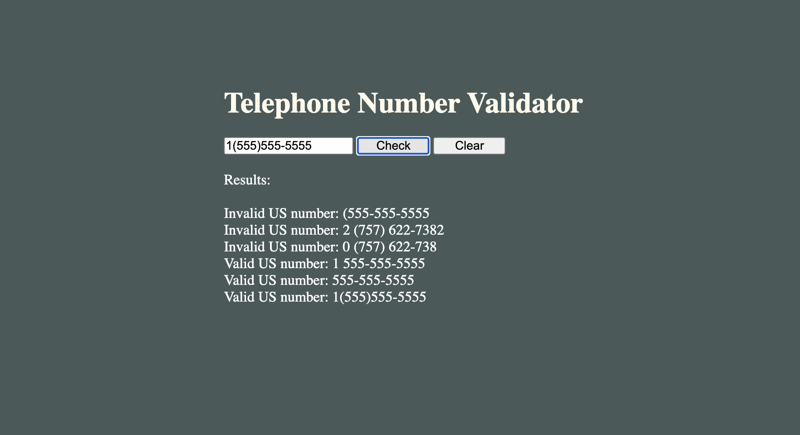

# US/Canada Phone Number Pattern Checker

---

## Features

- Validate phone numbers in the following formats:
  - `123-456-7890`
  - `1 123-456-7890`
  - `(123) 456-7890`
  - `1 (123) 456-7890`
  - `123 456 7890`
  - `1 123 456 7890`
  - `1234567890`
- Display results dynamically on the webpage.
- Clear the validation results easily with a single button click.

---

## Technologies Used

- **HTML**: For structuring the user interface.
- **CSS**: (Optional) For styling the interface (not included in this implementation).
- **JavaScript**: For handling input validation, regex matching, and DOM manipulation.

---

## Setup and Installation

1. Clone the repository:
   ```bash
   git clone <repository-url>
   ```

2. Navigate to the project directory:
   ```bash
   cd phone-pattern-checker
   ```

3. Open the `index.html` file in your browser to test the application.

---

## How to Use

1. Enter a phone number in the input field.
2. Click the "Check" button to validate the number.
3. View the result in the results area below the buttons.
4. Click the "Clear" button to reset the results.

---

## Regular Expression Patterns

The application uses the following regex patterns for validation:

- **Dashed Format**: `123-456-7890` or `1 123-456-7890`
- **Parentheses Format**: `(123) 456-7890` or `1 (123) 456-7890`
- **Spaced Format**: `123 456 7890` or `1 123 456 7890`
- **Continuous Format**: `1234567890`

---

## Screenshots

 

---

## Future Enhancements

- Support for international phone numbers.
- More user-friendly error messages and UI.
- Additional customization options for validating phone numbers.

---

## Contributing

Contributions are welcome! If you have suggestions or improvements, please open an issue or submit a pull request.

---

Happy coding!
# telephone-number-validator
